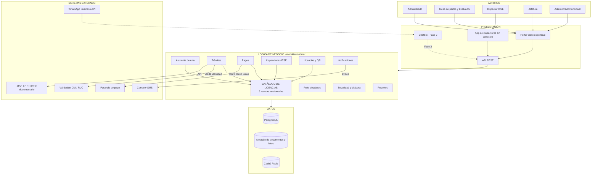
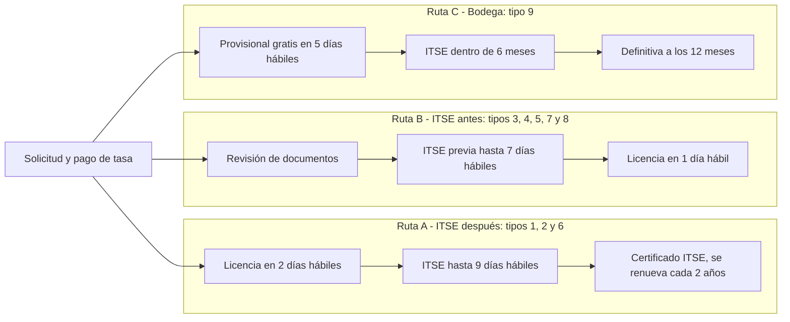

# Arquitectura inicial del sistema

## Estilo arquitectónico
**Monolito modular en tres capas, dirigido por un catálogo de licencias.**
Una sola aplicación organizada en módulos que comparten una base de datos PostgreSQL.
Todos los módulos consultan el **Catálogo de licencias** antes de actuar, por lo que las
reglas del TUPA viven en un solo lugar.

| Capa | Pregunta que responde | Componentes |
|---|---|---|
| Presentación | ¿Cómo interactúa el usuario? | Portal Web, app de inspectores sin conexión, API REST, chatbot (Fase 2) |
| Lógica de negocio | ¿Qué hace el sistema? | Catálogo, asistente de ruta, trámites, pagos, inspecciones, licencias, notificaciones, reloj de plazos, seguridad y reportes |
| Datos | ¿Dónde se almacena la información? | PostgreSQL, almacén de documentos y fotos, caché Redis |

## Diagrama de arquitectura

## Rutas del trámite

## Catálogo de licencias (las nueve recetas)

| N.° | Licencia | ITSE | Tasa (S/) | Plazo | Calificación | Ruta |
|---|---|---|---|---|---|---|
| 1 | Riesgo bajo | Posterior | 159.50 | 2 días | Automática | A |
| 2 | Riesgo medio | Posterior | 177.10 | 2 días | Automática | A |
| 3 | Riesgo alto | Previa | 305.90 | 8 días | Evaluación previa | B |
| 4 | Riesgo muy alto | Previa | 538.90 | 8 días | Evaluación previa | B |
| 5 | Corporativa | Previa | 529.20 | 8 días | Evaluación previa | B |
| 6 | Cesionarios, riesgo medio | Posterior | 180.40 | 2 días | Automática | A |
| 7 | Cesionarios, riesgo alto | Previa | 309.20 | 8 días | Evaluación previa | B |
| 8 | Cesionarios, riesgo muy alto | Previa | 542.20 | 8 días | Evaluación previa | B |
| 9 | Provisional para bodegas | Posterior (6 meses) | Gratis | 5 días | Automática | C |

Fuente: TUPA 2024 de la Municipalidad Provincial de Huanta. Plazos en días hábiles.

## Descripción

- **Presentación:** el administrado, el personal municipal y la jefatura entran por el Portal Web; los inspectores usan una app instalable que funciona sin conexión. Todos se comunican con el backend mediante una API REST. En la Fase 2 se suma un chatbot (web y WhatsApp) que usa la misma API.
- **Lógica de negocio:** una sola aplicación organizada en módulos. El **Catálogo de licencias** es el corazón: cada módulo lo consulta para saber qué requisitos pedir, qué tasa cobrar, qué ruta seguir y qué plazo controlar.
- **Datos:** PostgreSQL guarda toda la información con respaldo diario; los PDF, planos y fotos se guardan en un almacén aparte; Redis acelera el catálogo y el estado de los trámites.
- **Sistemas externos:** el módulo de Pagos se integra con la pasarela de pago; Trámites valida DNI/RUC; Notificaciones envía correos y SMS.

## Decisiones arquitectónicas

| Decisión | Alternativa descartada | Justificación | Driver |
|---|---|---|---|
| Catálogo versionado de recetas | Programar 9 procesos distintos | Un cambio del TUPA se carga como una versión nueva, sin tocar el código. | DA01 |
| Monolito modular | Microservicios | Más simple de construir, probar y mantener; permite separar módulos más adelante. | DA09 |
| Réplicas, balanceador, Redis y cola de tareas | Un solo servidor grande | Permite crecer agregando copias según la demanda. | DA02 |
| Identificador único por pago | Confiar en la pasarela | Evita cobros dobles ante reintentos. | DA04 |
| PWA sin conexión para inspectores | App nativa | Una sola base de código y funciona sin señal. | DA07 |
| Chatbot que lee el catálogo | Chatbot con respuestas libres | Responde con datos oficiales y no inventa requisitos ni costos. | DA08 |