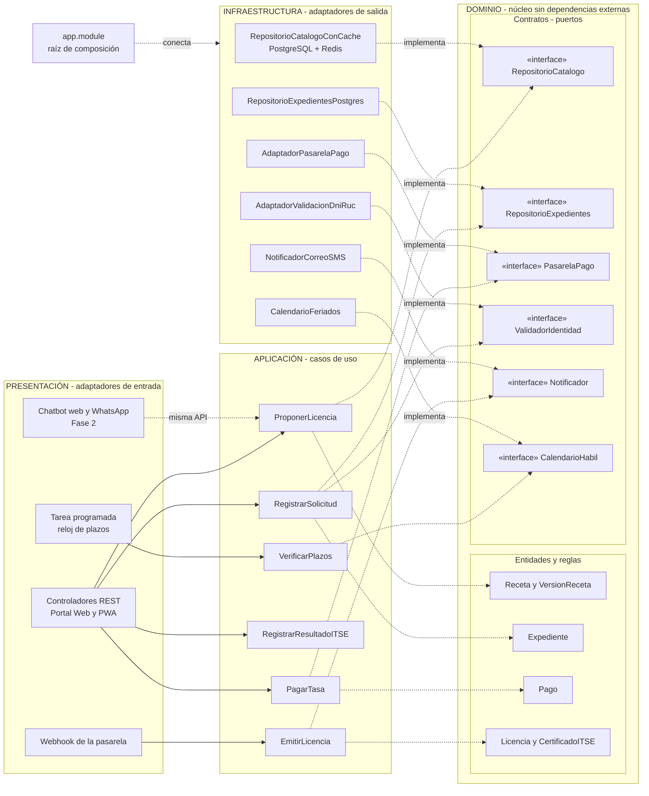

# Enfoque arquitectónico: Clean Architecture

| Elemento | Descripción aplicada al Sistema de Licencias de Huanta |
|---|---|
| Patrón / enfoque | Clean Architecture (Arquitectura Limpia). |
| Objetivo | Proteger las reglas del trámite (catálogo, rutas, tasas y plazos) y hacer que todas las dependencias apunten hacia el dominio. |
| ¿Qué problema resuelve? | Evita que las reglas del TUPA dependan de PostgreSQL, React, la pasarela de pago, los servicios de DNI/RUC o WhatsApp. |
| Capas definidas | Dominio, Aplicación, Infraestructura y Presentación. |
| Beneficios | Las reglas se prueban sin base de datos; se cambia de pasarela o de base sin tocar el negocio; el chatbot (Fase 2) se agrega como otro adaptador; cada módulo se mantiene por separado. |
| Driver que responde | DA10 - Independencia del negocio (y DA01, DA04, DA08). |

## Cómo se organizan las responsabilidades

| Capa | Qué contiene | Ejemplos en el sistema |
|---|---|---|
| **1. Dominio** (centro) | Entidades, objetos de valor, reglas y **contratos** | Entidades: `Expediente`, `Receta` (tipo de licencia), `VersionReceta`, `Requisito`, `Pago`, `Inspeccion`, `Licencia`, `CertificadoITSE`. Objetos de valor: `Tasa`, `PlazoDiasHabiles`, `Ruta` (A, B, C), `EstadoExpediente`, `DniRuc`. Contratos: `RepositorioCatalogo`, `RepositorioExpedientes`, `PasarelaPago`, `ValidadorIdentidad`, `Notificador`, `AlmacenDocumentos`, `CalendarioHabil`, `Bitacora`. |
| **2. Aplicación** | Casos de uso: orquestan el dominio usando contratos | `ProponerLicencia` (asistente de ruta), `RegistrarSolicitud`, `CalcularTasa`, `PagarTasa`, `AsignarInspeccion`, `RegistrarResultadoITSE`, `EmitirLicencia`, `VerificarPlazos`, `PublicarVersionCatalogo` |
| **3. Infraestructura** | Adaptadores que **implementan** los contratos | `RepositorioExpedientesPostgres`, `RepositorioCatalogoConCache` (Redis), `AdaptadorPasarelaPago`, `AdaptadorValidacionDniRuc`, `NotificadorCorreoSMS`, `AlmacenObjetos`, `CalendarioFeriados`, `BitacoraSoloEscritura` |
| **4. Presentación** | Adaptadores de entrada | Controladores REST, tarea programada del reloj de plazos, receptor de notificaciones de la pasarela (webhook), chatbot web y WhatsApp (Fase 2), Portal Web y PWA |

## Reglas de negocio que viven en el dominio (no dependen de ninguna tecnología)

1. Una receta define requisitos, tasa, plazo, calificación, orden del ITSE y vigencia.
2. Un expediente conserva la versión de receta con la que empezó.
3. La ruta A emite la licencia antes del ITSE; la ruta B, después; la ruta C emite una provisional gratuita de 12 meses.
4. Una licencia no se emite si el pago no está confirmado (salvo la ruta C, que es gratuita).
5. El plazo se cuenta en días hábiles desde la presentación completa.
6. Un mismo identificador de pago no puede cobrarse dos veces.

## Regla de dependencia

1. El **dominio** no importa nada de frameworks, base de datos ni servicios externos.
2. Los **casos de uso** solo conocen entidades y contratos.
3. La **infraestructura** implementa los contratos; sus adaptadores son intercambiables.
4. Un único lugar (la raíz de composición, por ejemplo `app.module`) decide qué adaptador cumple cada contrato.

## Estructura de carpetas propuesta (por módulo)

```
src/
├── modulos/
│   ├── catalogo/
│   │   ├── dominio/          # Receta, VersionReceta, Ruta, contratos
│   │   ├── aplicacion/       # ProponerLicencia, PublicarVersionCatalogo
│   │   ├── infraestructura/  # RepositorioCatalogoPostgres, cache Redis
│   │   └── presentacion/     # catalogo.controller
│   ├── tramites/  (misma estructura)
│   ├── pagos/
│   ├── inspecciones/
│   ├── licencias/
│   └── plazos/
├── compartido/               # Bitacora, Notificador, CalendarioHabil (contratos comunes)
└── app.module                # raíz de composición: conecta contratos con adaptadores
```

## Diagrama del enfoque



**Leyenda:** flecha continua = llamada en tiempo de ejecución; flecha punteada = dependencia de código, siempre hacia el dominio; "implementa" = el adaptador cumple el contrato (inversión de dependencias).

## Ejemplo: pagar la tasa sin cobro doble

1. El **controlador** recibe la petición de pago del Portal Web.
2. El caso de uso **`PagarTasa`** pide la tasa a la receta vigente del expediente (dominio).
3. Crea un **`Pago`** con un identificador único (regla de dominio: no se cobra dos veces).
4. Llama al contrato **`PasarelaPago`**, sin saber qué pasarela es.
5. El adaptador **`AdaptadorPasarelaPago`** hace la llamada real por HTTPS.
6. La confirmación llega por el **webhook**, que activa **`EmitirLicencia`**.

Para cambiar de pasarela solo se crea otro adaptador y se cambia `app.module`. **El dominio y los casos de uso no se tocan.**

## Diferencia con el estilo arquitectónico

| | Estilo (estilo-arquitectonico.md) | Enfoque (este archivo) |
|---|---|---|
| Responde | ¿Cómo es el sistema globalmente? | ¿Cómo se organiza el código por dentro? |
| Decisión | Monolito modular en capas | Clean Architecture |
| Dependencias | De arriba hacia abajo | Hacia el dominio (invertidas) |
