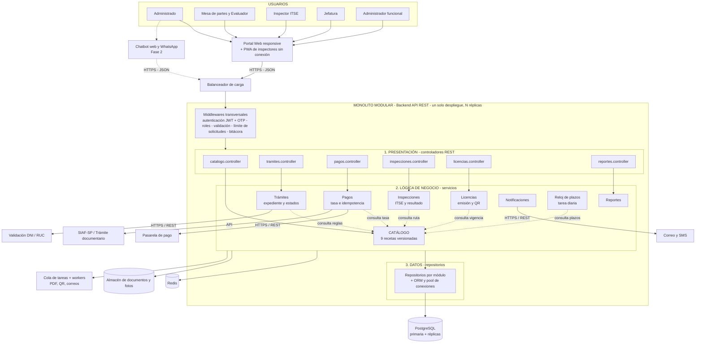

# Estilo arquitectónico

## Estilo seleccionado
**Monolito modular organizado en capas** (ADR-001).

- **Monolito:** el backend es una sola aplicación API REST con un solo despliegue, que se replica horizontalmente en los picos.
- **Modular:** se divide en módulos con límites claros: Catálogo, Trámites, Pagos, Inspecciones, Licencias, Notificaciones, Reloj de plazos, Reportes y Seguridad.
- **En capas:** cada módulo tiene Presentación (controladores), Lógica de negocio (servicios o casos de uso) y Datos (repositorios).
- **Centrado en el catálogo:** todos los módulos consultan el Catálogo antes de actuar (ADR-002).

El monolito es la **unidad de despliegue**; las capas son la **organización lógica**. Ambos coexisten.

## Justificación

| Driver | Cómo lo responde el estilo |
|---|---|
| DA09 - Simplicidad | Una sola aplicación y una sola base de datos, fácil de mantener para un equipo pequeño. |
| DA02 - Escalabilidad | El backend no guarda estado y se replica detrás de un balanceador. |
| DA01 - Modificabilidad | El catálogo concentra las reglas que cambian con el TUPA. |
| DA08 - Fase 2 | El chatbot entra como un canal más de la misma API. |

**Alternativa descartada:** microservicios. Exigen varias bases de datos, consistencia eventual, orquestación y más personal de TI, sin resolver el cuello de botella real, que es la base de datos.

## Diagrama del estilo arquitectónico

## Reglas de la arquitectura

1. Cada capa solo invoca a la capa inmediatamente inferior.
2. Un módulo no accede a las tablas de otro módulo; lo hace a través de su servicio.
3. Todos los módulos consultan el **Catálogo** para conocer las reglas del TUPA (no las repiten).
4. Las tareas lentas (PDF, QR, correos) van a la cola, no bloquean al usuario.
5. Todo corre como una sola aplicación, replicable, con una única base de datos principal.